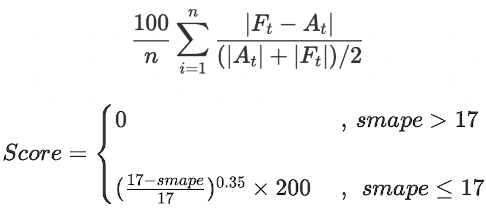

## Project Description :
Predict sale amount based on daily sale volume.

training-data : **train.csv**

test-data : **output.csv**

#### Preprocessing Steps :

* Analyze date with `jdatetime` and extract new features 
* Normalize data by `sklearn.preprocessing.Normalizer`
* Drop uncorrelated features

#### Score Function :

#### Different Models' Smape-Score :

## Requirements :

`jdatetime`

`pandas`

`numpy`

`sklearn`

`matplotlib`

`seaborn`

## Google Colab link:

*https://colab.research.google.com/drive/1Z2fwA7yk4btmcE38Gi5hfOA4x4XdALgI?usp=sharing*

